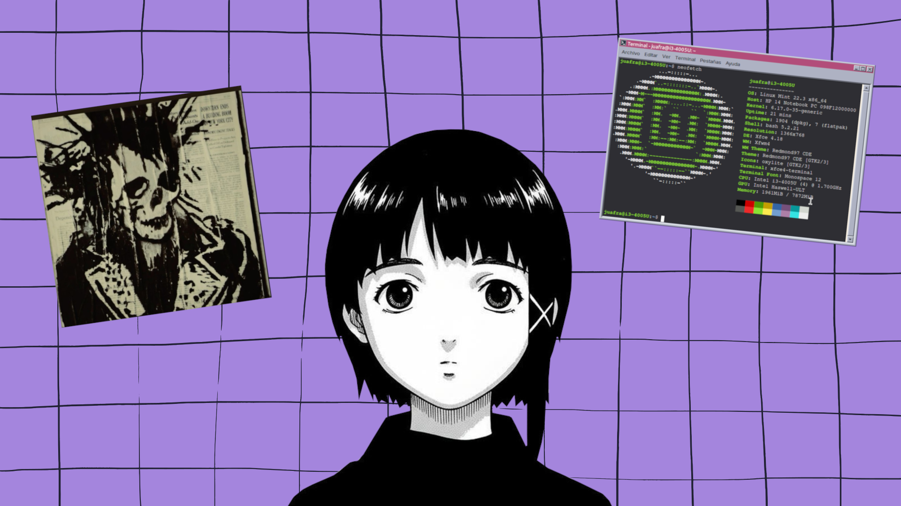

# dark-anime-punk-wallpapers
Collection of dark anime punk, aesthetic, and arch-hacker themed wallpapers. Optimized for Linux environments (1080p, lossless .png). Perfect for custom rice and terminal setups.

# ⚡ DARK CYBERPUNK & HACKER WALLPAPERS

<p align="center">
  
  
  
</p>

> 💻 Exclusive collection of wallpapers featuring dark anime punk, cyberpunk, and terminal/hacker aesthetics. Specially designed and optimized for lightweight Linux environments and advanced customizations (*ricing*).

---

## 📸 Previews

Here you can see a quick preview of the available designs. To download them in full quality without compression (1920x1080 `.png`), browse the `Wallpapers/` folder in this repository.

| Preview (250px) | File | Resolution | Format |
| :---: | :---: | :---: | :---: |
|  | `lain_wallpaper.png` | 1920x1080 | Lossless PNG |
|  | `wall.png` | 1920x1080 | Lossless PNG |

---

## 🛠️ Installation and Usage on Linux

### 📥 Option 1: Quick Terminal Clone (Recommended)
If you are a CLI user, clone the entire repository directly into your local Wallpapers directory with a single command:

```bash
git clone [https://github.com/Gu4mIMOUT/dark-anime-punk-wallpapers.git](https://github.com/Gu4mIMOUT/dark-anime-punk-wallpapers.git) ~/Wallpapers
